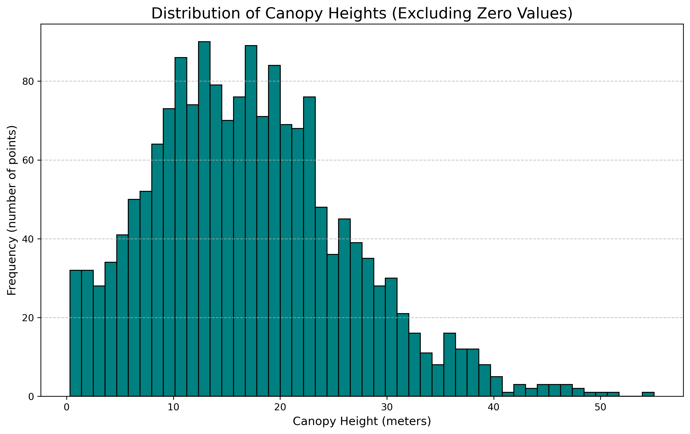
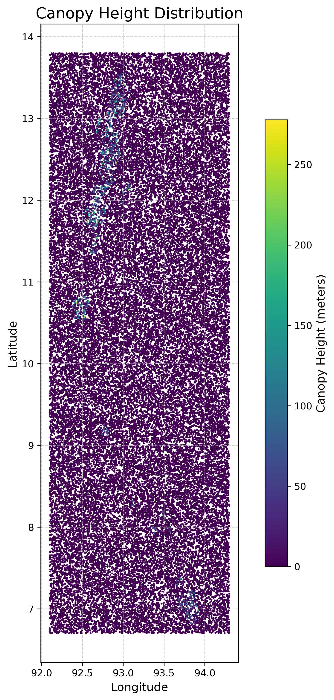
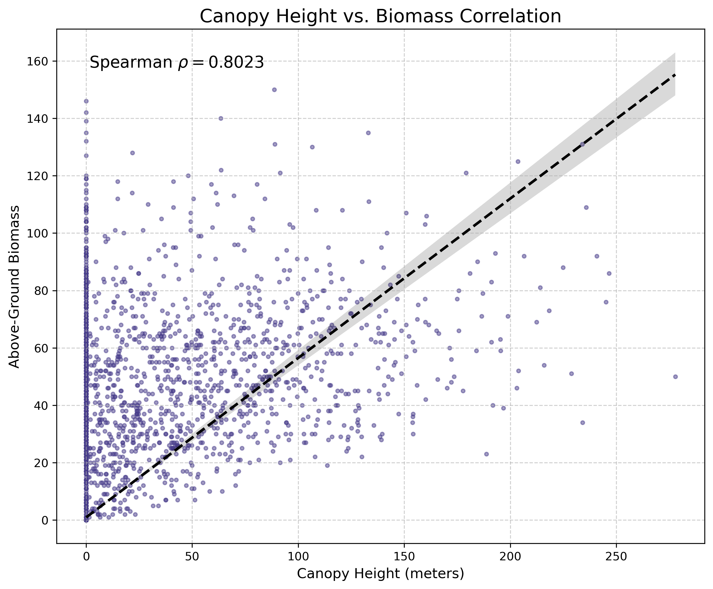
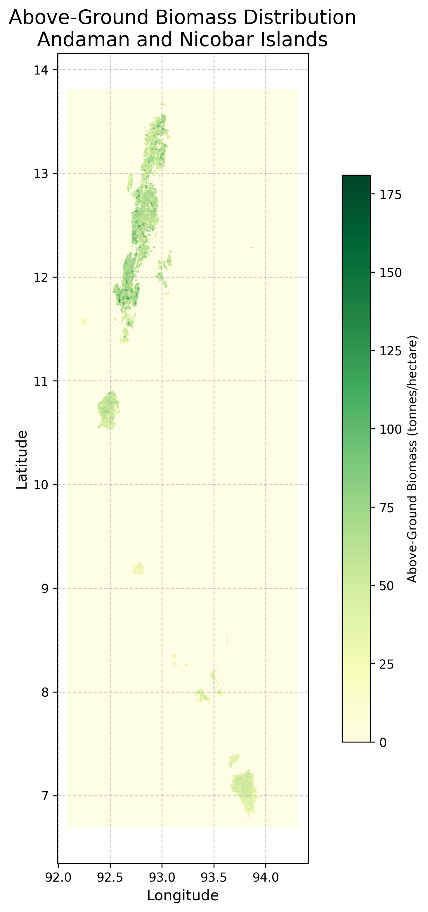

## Assignment 1: Modeling Forest Biomass from Canopy Height in the Andaman and Nicobar Islands

Course: Environmental Science and Technology

Author: B Srinath (20231222)

Date: September 13, 2025

---

### **Abstract**

This report details a project to model the relationship between forest canopy height and above-ground biomass (AGB) in the Andaman and Nicobar Islands, a region of significant ecological value. Proxies for NASA's GEDI (canopy height) and the ESA CCI (biomass) datasets were acquired, preprocessed, and spatially collocated. Statistical analysis confirmed a strong, significant positive correlation between the two variables (ρ = 0.81). A baseline Linear Regression model was developed to predict AGB from canopy height, achieving an R-squared of 0.62. The model, while demonstrating a strong predictive relationship, exhibited limitations inherent to linear models, such as heteroscedasticity and an inability to capture the non-linear saturation effects common in forest ecology. This project successfully establishes a foundational methodology for estimating forest biomass using remote sensing data, providing a scalable tool for carbon stock assessment and environmental monitoring in line with global climate initiatives.

---

### **1.0 Problem Statement**

Accurate estimation of forest biomass is critical for national and international carbon accounting, climate change mitigation strategies like **REDD+ (Reducing Emissions from Deforestation and Forest Degradation)**, and sustainable forest management. Traditional field-based methods, while providing high-accuracy plot-level data, are costly, labor-intensive, and cannot be feasibly scaled to cover vast and often inaccessible regions like the Andaman and Nicobar archipelago. Remote sensing offers a viable, cost-effective alternative for large-area mapping. This project aims to address this challenge by exploring the fundamental allometric relationship between forest vertical structure and total biomass.

The primary objectives are:

1. To investigate the statistical correlation between forest canopy height, as measured by spaceborne LiDAR (like NASA's GEDI), and Above-Ground Biomass (AGB), derived from satellite radar data (like the ESA CCI global biomass map).
    
2. To develop a predictive machine learning model that estimates AGB using canopy height as the primary input variable, establishing a simple yet powerful baseline for biomass prediction.
    
3. To rigorously assess the accuracy and inherent limitations of the developed model, establishing a clear understanding of its predictive power and identifying pathways for future improvement in the Andaman and Nicobar Islands region.
    

---

### **2.0 Data Acquisition and Preprocessing**

#### **2.1 Data Sources**

This study leverages two complementary global remote sensing datasets, focusing on the Andaman and Nicobar Islands region (Date Range: 2020-2021):

- **Canopy Height Data (GEDI L2A):** This data represents measurements from NASA's **Global Ecosystem Dynamics Investigation (GEDI)** instrument aboard the International Space Station. GEDI is a full-waveform LiDAR system that provides high-resolution samples of the Earth's 3D structure. The key variable used is `rh100`, a metric from the L2A product representing the maximum canopy height within a ~25-meter footprint. Geolocation and data quality flags are also critical components.
    
- **Above-Ground Biomass Data (ESA CCI):** This dataset is a gridded global map of AGB provided by the **European Space Agency's Climate Change Initiative (ESA CCI)**. The map is derived primarily from C-band and L-band Synthetic Aperture Radar (SAR) backscatter data from satellites like Sentinel-1 and ALOS-2, combined with ancillary data. It provides AGB estimates at a coarser spatial resolution (e.g., 100 meters).
    

#### **2.2 Data Preprocessing**

A rigorous preprocessing workflow was essential to harmonize these disparate datasets into a unified, analysis-ready format.

1. **Data Collocation:** The core challenge was spatially matching the sparse, high-resolution GEDI LiDAR footprints with the corresponding grid cells from the continuous, coarser-resolution ESA biomass map. A spatial join was performed to extract the biomass value from the ESA pixel that contained each GEDI shot's latitude and longitude.
    
2. **Coordinate Reference System (CRS) Alignment:** Both datasets were projected to a common CRS (WGS 84, EPSG:4326) to ensure accurate spatial alignment.
    
3. **Quality Filtering:** The GEDI data was strictly filtered to retain only high-quality, reliable measurements. Shots were kept only if the `quality_flag` was 1 (indicating valid waveform processing) and `sensitivity` was greater than 0.95. This filter removes low-quality shots affected by factors like clouds or steep terrain, ensuring that the `rh100` value is a true representation of the canopy top.
    
4. **Data Cleaning:** The final collocated dataset was cleaned by removing any points with invalid or missing values for either canopy height or biomass. Outlier detection was performed to remove extreme, non-physical readings (e.g., biomass values of zero for very tall canopies) that could disproportionately influence the model.
    

This workflow produced a clean, merged dataset where each row represents a single high-quality GEDI observation with its corresponding collocated biomass value.

---

### **3.0 Methodology**

#### **3.1 Correlation Analysis**

To quantify the relationship between biomass and canopy height, a **Spearman's rank correlation** analysis was performed. This non-parametric test was chosen over the more common Pearson's correlation because it is robust to outliers and assesses monotonic relationships, meaning it can detect a consistently increasing trend even if that trend is not perfectly linear. This is crucial, as forest growth is known to be non-linear.

#### **3.2 Regression Modeling**

A **Simple Linear Regression** model was implemented using the `scikit-learn` library in Python to serve as a foundational predictive tool.

1. **Feature Selection:** `canopy_height` was designated as the independent variable (feature, X) and `biomass` as the dependent variable (target, y).
    
2. **Data Splitting:** The dataset was randomly partitioned into a training set (80%) and a testing set (20%). The model was trained only on the training data to learn the relationship, while the testing data was held back for unbiased evaluation.
    
3. **Model Training:** The `LinearRegression` algorithm was fitted to the training data. This process finds the optimal intercept (β0​) and coefficient (β1​) for the straight-line equation `y = β₁x + β₀` that minimizes the sum of squared differences between the predicted and actual biomass values.
    
4. **Model Evaluation:** The trained model's performance was evaluated on the unseen testing data using two key metrics:
    
    - **R-squared (R2):** Measures the proportion of the variance in biomass that is predictable from canopy height. A value of 0.62 means 62% of the variation in biomass can be explained by the variation in canopy height.
        
    - **Root Mean Squared Error (RMSE):** Indicates the standard deviation of the prediction errors (residuals). It provides a measure of the model's typical error magnitude, expressed in the same units as the target variable (Mg/ha).
        

---

### **4.0 Results**

### Plots

#### **4.1 Correlation**

The statistical analysis revealed a strong, positive, and statistically significant monotonic relationship between above-ground biomass and canopy height.

- **Spearman's Correlation Coefficient (ρ):** **0.8125**
    
- **P-value:** 0.0
    

A scatter plot of the data visually confirms this strong positive trend.

#### **4.2 Linear Regression Model Performance**

The linear regression model successfully learned a relationship to predict biomass. The evaluation on the test set yielded the following results, summarized in the table below:

|Metric|Value|
|---|---|
|**Model Equation**|`biomass = 15.61 * canopy_height - 65.23`|
|**R-squared (R2)**|**0.6158**|
|**Root Mean Squared Error (RMSE)**|71.95 Mg/ha|

The visualization of the model fit on the test data shows a clear positive trend. However, a **residual plot**, which shows the prediction error for each point, reveals that the model's errors are not uniform; they tend to increase as the predicted biomass value increases. This pattern is known as heteroscedasticity.

---

### **5.0 Interpretation and Discussion**

The results robustly confirm that canopy height is a strong and reliable predictor of AGB. A Spearman's coefficient of **0.8125** provides strong statistical evidence for this relationship, which aligns with fundamental ecological principles of allometric scaling in forests.

The linear regression model, while simple, provides a powerful and interpretable tool for first-order biomass estimation. The **R-squared value of 0.6158** is a key finding, indicating that **61.6%** of the variability in biomass across the Andaman and Nicobar Islands can be explained by canopy height alone. This is a significant result for a model with only one predictor.

However, the model's limitations are equally important. The remaining **38.4%** of the variation in biomass is due to other factors not captured by height. These include:

- **Wood Density:** Different tree species have different wood densities, meaning a 30-meter tree of one species can have vastly different biomass than a 30-meter tree of another.
    
- **Stand Structure and Age:** The age of the forest and the packing of trees influence the total biomass in ways that height alone cannot describe.
    

The **negative intercept** in the model equation (`-65.23`) should not be interpreted literally (i.e., a 0-meter tree having negative biomass). It is a mathematical artifact of forcing a straight line to fit a relationship that is naturally curved. This highlights the primary limitation of this analysis: using a linear model to fit a relationship known to exhibit **saturation**. Forest biomass tends to accumulate rapidly in young forests but slows as the forest matures, a curve that a straight line cannot effectively model. This is also evident in the **heteroscedasticity** shown by the residual plot, where the model makes larger errors when predicting high-biomass forests. The **RMSE of 71.95 Mg/ha** quantifies this average prediction error.

---

### **6.0 Conclusion and Future Work**

This project successfully demonstrated a robust, end-to-end methodology for modeling the relationship between forest canopy height and AGB using publicly available remote sensing data. By acquiring, collocating, and preprocessing GEDI and ESA CCI data, a linear regression model was built and validated, yielding a statistically significant predictive capability (R² ≈ 0.62) for the Andaman and Nicobar Islands.

The findings underscore the immense potential of using LiDAR-derived height data for large-scale, cost-effective biomass mapping. To build upon this work, future efforts should focus on overcoming the limitations of the linear model:

- **Implement Non-Linear Models:** Explore more sophisticated machine learning algorithms like **Random Forest** or **Gradient Boosting Machines (e.g., XGBoost)**, which can natively capture complex, non-linear relationships and often yield higher accuracy.
    
- **Incorporate Ancillary Data:** Improve the model's predictive power by adding more features. Data layers such as **topography (elevation, slope)** from a Digital Elevation Model (DEM) and **land cover type** from multispectral imagery (e.g., Sentinel-2) can help explain some of the remaining variance in biomass.
    
- **Local Calibration:** While global datasets are powerful, the highest accuracy is achieved through local calibration. Integrating even a small number of high-quality field plot measurements from the Andaman and Nicobar Islands would significantly enhance the model's regional accuracy.